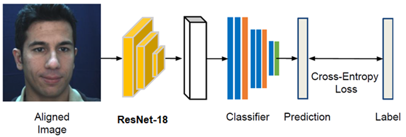

# Assessment of Cognitive Load and Emotion using Ocular and Facial Microexpressions

This project aims to assess the validity of using eye motion features as indicators of *cognitive load* and *emotional state*. Ocular features such as saccades and fixations, subjective questionnaires and task performance measures has been used to assess the **mental workload** while the user performs the designed tasks. Simultaneous acquisition of physiological signal is performed, which is currently the high-speed image sequence of user’s face as input. **Facial micro-expression intensity** has been estimated using a ResNet based model along with ocular features while the users were shown emotional stimuli.

The scheme has been validated with psychological tests such as *visual response test (VRT)* which induces mental fatigue and *N-back test* which induces memory load. Correlation between the physiological signal (eye movement and blink) and the psychological test response has been observed with the change in mental workload. Moreover, user emotional state has been observed to have correlation with eye motion behaviour and has been validated with the detection of activation of corresponding facial action units based on **Facial Action Coding System (FACS)**.

|            | Module                                                       | Contents |
| ---------- | ------------------------------------------------------------ | ------- |
| 1          | [Eye Tracking](https://github.com/chatterjeesaurabh/Assessment-of-Cognitive-Load-and-Emotion-using-Ocular-and-Facial-Microexpressions/tree/main/Eye%20Tracking)                                                 | Eye detection, blink detection, eye motion features classification, screen gaze, emotion classification |
| 2          | [Visual Response Test](https://github.com/chatterjeesaurabh/Assessment-of-Cognitive-Load-and-Emotion-using-Ocular-and-Facial-Microexpressions/tree/main/VRT)       | Psychometric test game made using PyGame       |
| 3          | [Facial Expression Estimation](https://github.com/chatterjeesaurabh/Assessment-of-Cognitive-Load-and-Emotion-using-Ocular-and-Facial-Microexpressions/tree/main/Face%20Action%20Unit%20Intensity%20Estimation)                                 | Deep learning model for facial Action Unit intensity estimated       |

## Brief Steps
* Developed face and facial landmark detection pipeline for video, and performed pupil localization by radial inspection of gradients. Developed CUDA algorithms to accelerate execution speed by 300 times.
* Alternatively, used Mediapipe Face Landmark model to detect and track eye iris, eye corners and eyelid coordinates.
* Blink detection and iris location correction using Cubic Spline interpolation.
* Screen gaze and heatmap estimation using Polynomial Regression. Classified eye motion into saccades and fixations using iris velocity and dispersion based thresholds.
* Designed psychometric game(s): Visual Response Test and N-Back Test, which can induce different levels of mental workload.
* Built deep learning model using ResNet-18 by pre-training with large facial expression datasets ([AffectNet](http://mohammadmahoor.com/affectnet/) and [EmotioNet](https://www.cv-foundation.org/openaccess/content_cvpr_2016/papers/Benitez-Quiroz_EmotioNet_An_Accurate_CVPR_2016_paper.pdf)) and further fine tuned with action unit intensity labels ([DISFA](http://mohammadmahoor.com/disfa/) dataset) to estimate facial micro-expressions.

## Eye Detection and Tracking

  

## Cognitive Load Assessment Methodology

  

## Emotion Assessment Methodology

  
  
  

### Datasets Supported

| Dataset             | Type         | Size       | Features 
| ------------------- | ------------ | ---------- | ------------------ |
| EmotioNet           | Image        | 9,75,000   | 8 Emotions         |
| AffectNet           | Image        | 4,50,000   | 16 Overall Emotions, 6 Basic Emotions  |
| DISFA               | Video        | 27         | 12 Action Units                 |

## Contributions
[Saurabh Chatterjee](https://github.com/chatterjeesaurabh)  
MTech, Signal Processing and Machine Learning  
IIT Kharagpur
