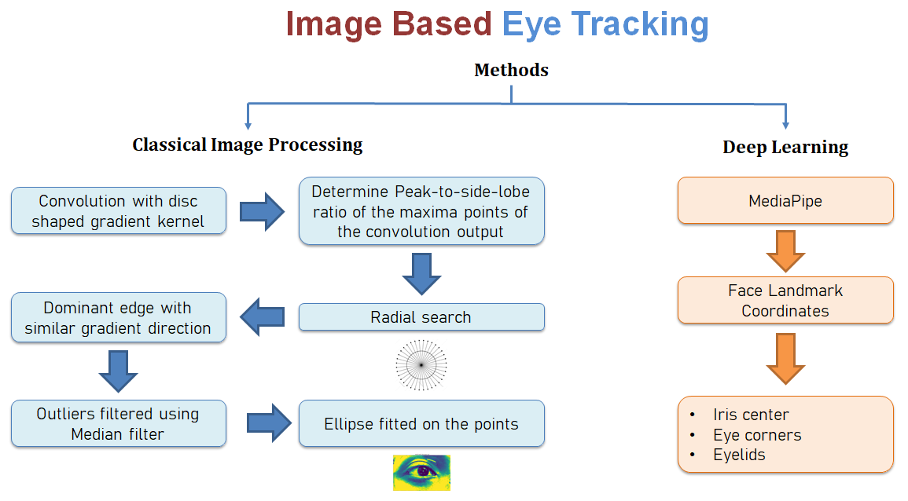
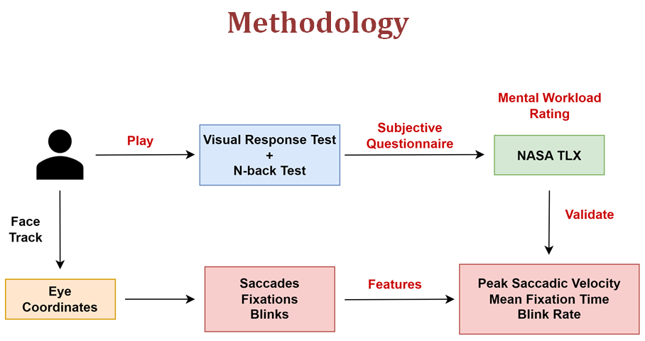
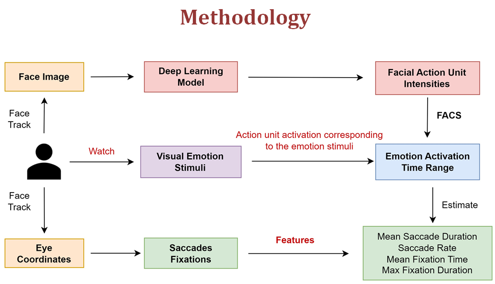
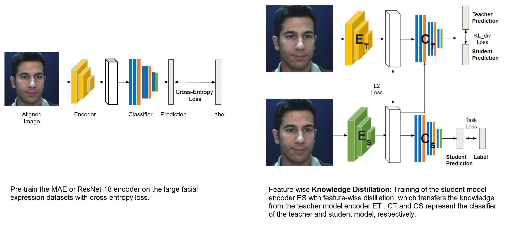
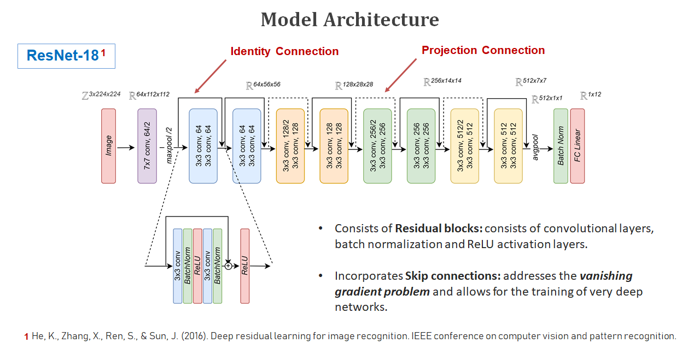

# Assessment of Cognitive Load and Emotion using Ocular Features and Facial Microexpressions
 
This project aims to assess the validity of using eye motion features as indicators of *cognitive load* and *emotional state*. Ocular features such as *saccades* and *fixations*, subjective questionnaires and task performance measures has been used to assess the **mental workload** while the user performs the designed tasks. Simultaneous acquisition of physiological signal is performed, which is currently the high-speed image sequence of user’s face as input. **Facial micro-expression intensity** has been estimated using **ResNet-18** based model trained with **Knowledge-Distillation** from **Masked Auto-Encoder**, along with ocular features while the users were shown emotional stimuli.

The scheme has been validated with psychological tests such as *visual response test (VRT)* which induces mental fatigue and *N-back test* which induces memory load. Correlation between the physiological signal (eye movement and blink) and the psychological test response has been observed with the change in mental workload. Moreover, user emotional state has been observed to have correlation with eye motion behaviour and has been validated with the detection of activation of corresponding facial action units based on **Facial Action Coding System (FACS)**.

|            | Module                                                       | Contents |
| ---------- | ------------------------------------------------------------ | ------- |
| 1          | [Eye Tracking](https://github.com/chatterjeesaurabh/Assessment-of-Cognitive-Load-and-Emotion-using-Ocular-and-Facial-Microexpressions/tree/main/Eye%20Tracking)                                                 | Eye detection, blink detection, eye motion features classification, screen gaze, emotion classification |
| 2          | [Visual Response Test](https://github.com/chatterjeesaurabh/Assessment-of-Cognitive-Load-and-Emotion-using-Ocular-and-Facial-Microexpressions/tree/main/VRT)       | Psychometric test game made using PyGame       |
| 3          | [Facial Expression Estimation](https://github.com/chatterjeesaurabh/Assessment-of-Cognitive-Load-and-Emotion-using-Ocular-and-Facial-Microexpressions/tree/main/Face%20Action%20Unit%20Intensity%20Estimation)                                 | Deep learning model for facial Action Unit intensity estimation       |

## Brief Steps
* Developed face and **facial landmark** detection pipeline for video, and performed **pupil localization** by radial inspection of gradients. Developed **CUDA** algorithms using **Numba** to accelerate execution speed by 300 times.
* Alternatively, used Mediapipe Face Landmark model to detect and track eye iris, eye corners and eyelid coordinates.
* Performed **blink detection**, and iris location correction using Cubic Spline interpolation.
* Screen gaze and heatmap estimation using **Polynomial Regression**. Classified eye motion into saccades and fixations using iris velocity and dispersion based thresholds.
* Designed psychometric game(s): Visual Response Test and N-Back Test, which can induce different levels of mental workload.
* Built deep learning model using **ResNet-18** by pre-training with large facial expression datasets ([AffectNet](http://mohammadmahoor.com/affectnet/) and [EmotioNet](https://www.cv-foundation.org/openaccess/content_cvpr_2016/papers/Benitez-Quiroz_EmotioNet_An_Accurate_CVPR_2016_paper.pdf)) and further fine tuned with action unit intensity labels ([DISFA](http://mohammadmahoor.com/disfa/) dataset) along with simultaneous **Knowledge-Distillation** from a larger **Masked Auto-Encoder** model to estimate facial micro-expressions.

## Eye Detection and Tracking

  

## Cognitive Load Assessment Methodology

  

## Emotion Assessment Methodology

- The objective is to estimate facial emotion from expression using facial *Action Units (AUs)* intensity and *FACS (Facial Action Coding System)* in real-time.
- To accomplish this, used a large-scale pre-trained network (**Masked Auto-encoder**) and performed feature-wise **knowledge distillation** with task-specific fine-tuning on a lightweight model (**ResNet-18**) to get facial *Action Unit* intensity in real-time.
- Designed visual emotion stimuli to induce different emotions and simultaneously acquire eye coordinates and face video to estimate eye-motion features and facial micro-expression corresponding to the shown emotion stimulus.

  

### Method
- The training method has been adapted from [Chang et. al.](#references)
- A **Masked Auto-encoder** (*MAE*) is used which was pre-trained in self-supervised manner (masked input image reconstruction task) with [EmotioNet](https://www.cv-foundation.org/openaccess/content_cvpr_2016/papers/Benitez-Quiroz_EmotioNet_An_Accurate_CVPR_2016_paper.pdf) dataset. Subsequently, only the encoder part is extracted and attached to a linear classification layer, and further pre-trained on [AffectNet](http://mohammadmahoor.com/affectnet/) and FFHQ dataset which are large facial expression datasets before finally fine-tuning on the [DISFA](http://mohammadmahoor.com/disfa/) dataset for facial *Action Unit* intensity estimation.
- Now, since the *MAE* is a large model, to perform faster and real-time estimation, employed **feature-wise knowledge distillation** to transfer the *teacher model*'s (**MAE**) knowledge to a lightweight *student model* (**ResNet-18**).
- The *ResNet-18* model with linear classification layer attached, is first pre-trained on the same AffectNet and FFHQ datasets and then fine-tuned with simultaneous knowledge distillation from teacher model on DISFA dataset for facial *Action-Unit* intensity estimation.
- Using the facial *Action Unit* intensity values, their activation is assessed and based on **FACS (Facial Action Coding System)**  which defines a relation between the action units and emotion, the overall facial emotion is estimated.

  
  

### Losses

1. **Feature Matching Loss**: A *MSE* loss between hidden feature layers of the *teacher* model and the *student* model. \
$`\mathcal{L}_{FM} = \left\|f_{T} - \textbf{I}(f_{S})\right\| ^{2}`$

2. **KL Divergence Loss**: between *teacher* model's output for (i) the input face image and  (ii) the *student* model's hidden feature layer input to the *teacher* linear classifiation layer. \
$`\mathcal{L}_{KLD} = -\widehat{y}_{T} ~ \text{log} (\frac{\widehat{y}_{T}}{\widehat{y}_{S}})`$

3. **Task Loss**: The training *MSE* loss for the *student* network. \
$`\mathcal{L}_{Task} = \left\|\widehat{y} - y\right\| ^{2}`$

- **Overall Loss:** $`\mathcal{L} = \mathcal{L}_{FM} + \alpha\mathcal{L}_{Task} + \beta\mathcal{L}_{KLD}`$

Performance on DISFA datast for facial *Action Unit* intensity estimation task: 

| Method                 | PCC        |  MAE     | MSE      | Remarks |
| ---------------------- | -----------| -------- | -------- |--|
| ResNet-18              |   0.518    |  0.278   |  0.352   | - |
| ResNet-18 + Pre-Train  |   0.614    |  0.236   |  0.260   | - |
| **ResNet-18 + FM Distill** |   **0.628**    |  **0.244**   |  **0.260**   | Better performance and faster  |
| MAE + Pre-Train        |   0.674    |  0.202   |  0.270   | Best performance, but heavy and slowest |

### Datasets

| Dataset             | Type         | Size       | Features 
| ------------------- | ------------ | ---------- | ------------------ |
| EmotioNet           | Image        | 9,75,000   | 8 Emotions         |
| AffectNet           | Image        | 4,50,000   | 16 Overall Emotions, 6 Basic Emotions  |
| DISFA               | Video        | 27         | 12 Action Units                 |

## Contributions
[Saurabh Chatterjee](https://github.com/chatterjeesaurabh)  
MTech, Signal Processing and Machine Learning  
Indian Institute of Technology (IIT) Kharagpur

## References
- D. Chang, Y. Yin, Z. Li, M. Tran and M. Soleymani, "LibreFace: An Open-Source Toolkit for Deep Facial Expression Analysis," in 2024 IEEE/CVF Winter Conference on Applications of Computer Vision (WACV), Waikoloa, HI, USA, 2024 pp. 8190-8200. doi: 10.1109/WACV57701.2024.00802.
